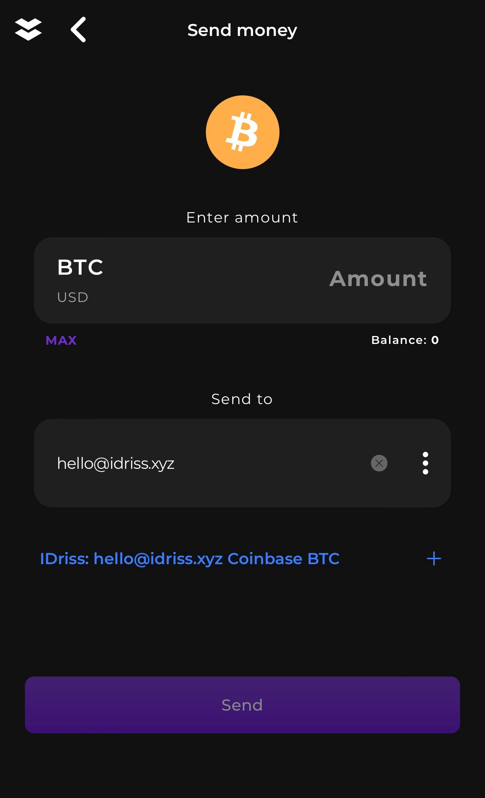
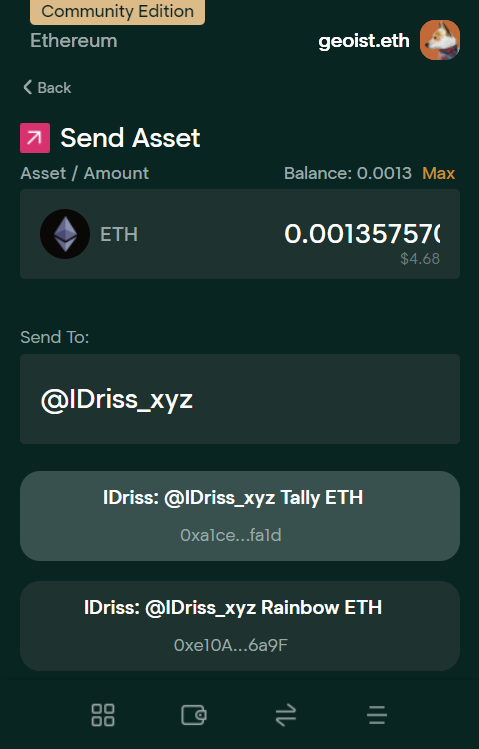

# For Developers

Wallet addresses are a central part of the user experience associated with sending and receiving cryptocurrency. The established address format (long string of numbers and letters) needs to be replaced with a more human-centric solution to improve the experience of the current crypto users and accommodate the wave of non-crypto-native people that will be flowing into web3 in the coming decade.

IDriss aims at solving the above-mentioned challenge by letting users link their emails, phone numbers and Twitter usernames to crypto wallet addresses in a decentralized registry.

The key benefits of integrating IDriss are:

* User-friendly wallet address format that can be easily shared verbally, or in writing for the purpose of sending or receiving crypto
* Effective organization and quicker access to your multiple wallet addresses (you have them available under one, memorable IDriss)
* Easier transactions to and from integrated wallets
* Quicker search for other users inside your application
* Additional revenue stream though our shared revenue model

#### **IDriss name support**

Users are able to input IDriss names (emails, phone numbers, and Twitter usernames) in the recipient field within the recipient field and see wallet addresses that have been linked to them. Working examples from within the [Elastos Essentials mobile wallet](https://elastos.info/essentials-the-super-wallet/) and [Tally Ho! Wallet](https://gov.tally.cash/t/tip-2-integration-of-idriss-into-tally-ho-wallet-draft/596) are displayed below.

 

#### **Onboarding to IDriss inside the wallet**

Users are able to register their IDriss (email, phone number or Twitter username) inside your application. We will perform identity verification for you and allow your users to carry their verified IDriss across protocols. 20% of the revenue generated by this feature goes to your treasury. To learn about how to set this up, continue reading Shared Revenue Model. A preliminary UI/UX design of the registration flow is presented below:

.png>)

#### Reverse Records

IDriss users can opt-in for reverse records. This allows for translation from wallet address to IDriss. With this functionality, you can give users a more trusted overview of who they interact with in your application. An example of how reverse records could look in an etherscan integration is seen below.

Other benefits of an integration of reverse records are

* Users instantly recognize other user's identity and distinguish it from other data in the dapp's interface.
* Interaction with [@geoist\_](https://twitter.com/geoist\_) instead of a hex address provides more context about the other party. It also adds a way to message them. This is especially good for NFT marketplaces.
* Your Twitter username becomes your portable identity across integrated web3 apps.
* It's easier to find the right people to delegate your votes to on governance platforms like [@SnapshotLabs](https://twitter.com/SnapshotLabs).
* Helps with verifying whether a given address is a real human.
